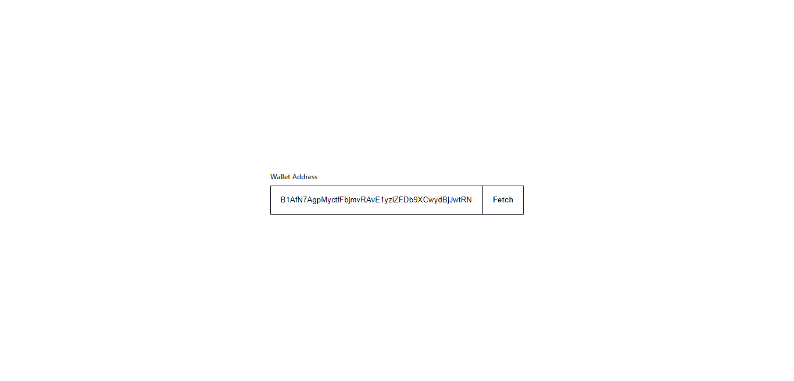
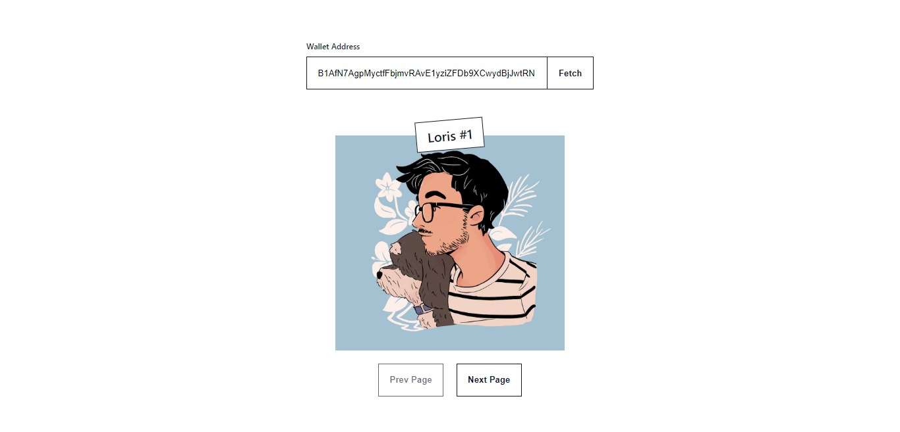

# Fetch and paginate NFTs in a given wallet

Pagination is not really a thing when it comes to the `getProgramAcccount` RPC method. This tutorial demonstrates how you can still simulate NFT pagination by lazy loading NFTs and fetching their metadata on demand.

We will be using the [findAllByOwner](https://github.com/metaplex-foundation/js#findallbyowner) method in the Metaplex SDK which will give us the list of NFTs without their JSON metadata loaded. This is important because if we had to fetch hundreds of NFTs with their JSON metadata, it will take a lot of time and greatly impact the performance of the application.

In this tutorial, we are going to:
- Use the `findAllByOwner` method.
- Store the list of lazy-loaded NFTs.
- Fetch the metadata of for each NFT in the current page.


Okay, let's get started! 🔥

Note that you can find all the code below in this [`pages/index.js` file](./pages/index.js).

1. **Create a new Next.js app.**

   This example uses a new NextJS app with Metaplex which can be created by following the instructions listed in [Getting Started with Metaplex and Next.js](../getting-started-nextjs).

2. **Fetch all NFTs of a given wallet without their JSON metadata.**

   Once the user fills in their wallet address and clicks the "Fetch" button, we call the following `fetchNFTs` function.

   ```js
   const fetchNFTs = async () => {
      try {
         setLoading(true);
         setCurrentView(null);
         const list = await mx.nfts().findAllByOwner({ owner: new PublicKey(address)});
         setNftList(list);
         setCurrentPage(1);
      } catch (e) {
         console.error(e);
      }
   };
   ```
   This sets the `Loading` state to true, invalidates the current view and calls the `findAllByOwner` method of the Metaplex SDK with the wallet address as input.

   The returned data is then set to the `nftList` state and the current page is reset to the first page since we will be displaying a new list of NFTs.

3. **Load the JSON metadata of every NFT in the current page.**

   We then use a `useEffect` hook to load the NFTs of the current page whenever `nftList` or `currentPage` gets updated.

   For instance, when the user provides its wallet address, the `nftList` is updated and `currentPage` is set to 1, which means the `useEffect` hook will be triggered.

  ```js
   useEffect(() => {
    if (!nftList) {
      return;
    }

    const execute = async () => {
      const startIndex = (currentPage - 1) * perPage;
      const endIndex = currentPage * perPage;
      const nfts = await loadData(startIndex, endIndex);

      setCurrentView(nfts);
      setLoading(false);
    };

    execute();
  }, [nftList, currentPage]);
  ```

   This useEffect calls the `loadData` function which goes through the NFTs falling in the index range of current page and loads the NFT metadata that isn't loaded yet.

   ```js
   const loadData = async (startIndex, endIndex) => {
    const nftsToLoad = nftList.filter((_, index) => (index >= startIndex && index < endIndex))

    const promises = nftsToLoad.map((metadata) => mx.nfts().load({ metadata }));
    return Promise.all(promises);
  };
   ```

   The range of NFTs falling on the current page is then set to the `currentView` state and displayed.

4. **What happens when the page changes?**

   Whenever the user clicks the "Next Page" or "Prev Page" button, the `useEffect` hook is again triggered. That means, it will load the JSON metadata for any NFT within that index range that isn't already loaded and display them to the current view.

5. **That's it!** 🎉

   Congrats, you've now got a simple app that displays the NFTs inside a wallet. Let's see the final output!

   Landing Screen
   

   Fetched NFTs (First Page)
   

